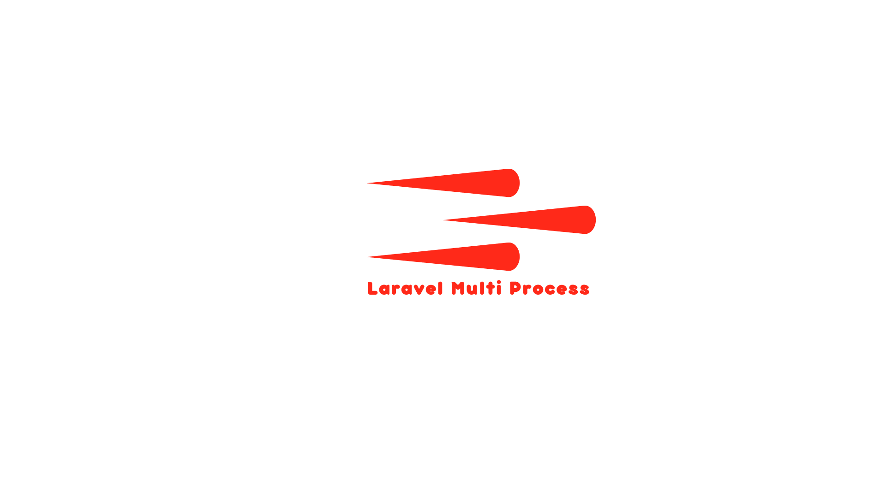

[](https://github.com/syrian-open-source/laravel-multi-process/actions/workflows/php.yml)
[](https://github.com/syrian-open-source/laravel-multi-process/actions/workflows/tests.yml)

    
# Multi Process

Laravel package making you able to perform several process instead of executing them through one process
Installation

##### 1 - Dependency
The first step is using composer to install the package and automatically update your composer.json file, you can do this by running:

```shell
composer require syrian-open-source/laravel-multi-process
```
##### 2 - Copy the package providers to your local config with the publish command, this will publish the config:
```shell
php artisan multi-process:install
```

Features
-----------
- [Run process from commands](https://github.com/syrian-open-source/laravel-multi-process/blob/main/docs/commands.md)
- [Run php codes](https://github.com/syrian-open-source/laravel-multi-process/blob/main/docs/php.md)


Changelog
---------
Please see the [CHANGELOG](https://github.com/syrian-open-source/laravel-multi-process/blob/master/CHANGELOG.md) for more information about what has changed or updated or added recently.

Security
--------
If you discover any security related issues, please email them first to karam2mustafa@gmail.com, 
if we do not fix it within a short period of time please open a new issue describing your problem. 

Credits
-------
[karam mustafa](https://www.linkedin.com/in/karam2mustafa)

About Syrian Open Source
-------
The Syrian Open Source platform is the first platform on GitHub dedicated to bringing Syrian developers from different cultures and experiences together, to work on projects in different languages, tasks, and versions, and works to attract Syrian developers to contribute more under one platform to open source software, work on it, and issue it with high quality and advanced engineering features, which It stimulates the dissemination of the open-source concept in the Syrian software community, and also contributes to raising the efficiency of developers by working on distributed systems and teams.
